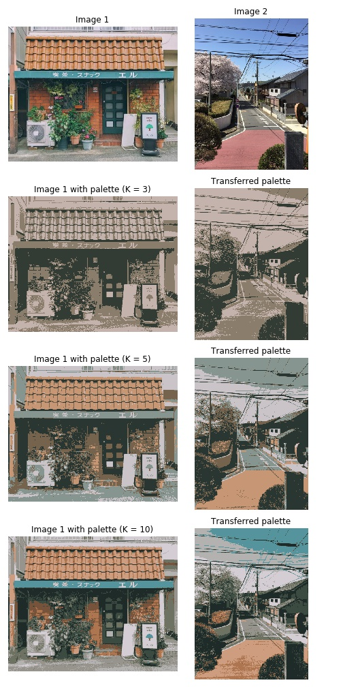

# Palette Transfer

Transfer color palette from an image to another. This work done by training a clustering algorithm to 
cluster each pixel intensity of an image, and apply the trained algorithm to another image.

# Example

